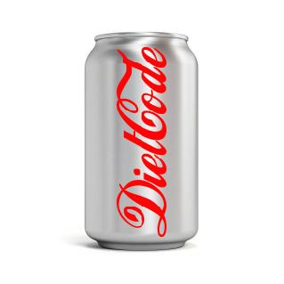

# DietCode MLSys 2022 Artifact



- [Prerequisites](#prerequisites)
- [Code Organization](#code-organization)
- [Build Instructions](#build-instructions)
- [References](#references)

## Prerequisites

- Minimum Requirement: A machine with a modern NVIDIA GPU and GPU Driver
  version >= **465.19.01** (for CUDA 11.3) [1].

- Docker & Docker-Compose [2]:

  ```Bash
  # Docker Installation Steps
  curl https://get.docker.com | sh && sudo systemctl --now enable docker
  ```

  ```Bash
  # NVIDIA Docker Installation Steps
  distribution=$(. /etc/os-release;echo $ID$VERSION_ID) \
          && curl -s -L https://nvidia.github.io/nvidia-docker/gpgkey \
                  | sudo apt-key add - \
          && curl -s -L https://nvidia.github.io/nvidia-docker/$distribution/nvidia-docker.list \
                  | sudo tee /etc/apt/sources.list.d/nvidia-docker.list
  curl -s -L https://nvidia.github.io/nvidia-container-runtime/experimental/$distribution/nvidia-container-runtime.list \
          | sudo tee /etc/apt/sources.list.d/nvidia-container-runtime.list
  sudo apt-get update
  sudo apt-get install -y nvidia-docker2
  sudo systemctl restart docker
  ```

  ```Bash
  # Docker-Compose Installation Steps
  pip3 install docker-compose
  ```

## Code Organization

- [**`tests`**](./tests): Contains test cases for testing code generation
  changes (i.e., local padding & decision-tree dispatching) and benchmarking
  performance. Please click on the folder for more details.
  
- [**`tvm_base`**](./tvm_base): A clean TVM branch that has only a few changes
  (for performance benchmarking only). Please refer to
  [this page](https://github.com/UofT-EcoSystem/tvm/compare/bojian/DietCode_base...bojian/DietCode/base)
  for the changes made at this branch.

- [**`tvm`**](./tvm): *DietCode* that is built on top of TVM. Please refer to
  [this page](https://github.com/UofT-EcoSystem/tvm/compare/bojian/DietCode_base...bojian/DietCode/stable)
  for the changes made at this branch.

## Build Instructions

- Build and Run the Docker image:

  ```Bash
  docker-compose run --rm tvm-dev
  ```

- Build *DietCode* and the TVM baseline:

  ```Bash
  # DietCode
  /mnt $ cd tvm
  /mnt/tvm $ mkdir build && cd build
  /mnt/tvm/build $ cmake -DUSE_CUDA=/usr/local/cuda/ \
                         -DUSE_LLVM=/usr/lib/llvm/bin/llvm-config \
                         -DUSE_CUBLAS=1 \
                         -DUSE_CUDNN=1 .. && \
                   make -j 4
  # build the Python binding
  /mnt/tvm/build $ cd ../python
  /mnt/tvm/python $ python3 setup.py build

  # TVM Base (same procedure)
  /mnt/tvm/build $ cd ../../tvm_base
  /mnt/tvm_base $ mkdir build && cd build
  /mnt/tvm_base/build $ cmake -DUSE_CUDA=/usr/local/cuda/ \
                              -DUSE_LLVM=/usr/lib/llvm/bin/llvm-config \
                              -DUSE_CUBLAS=1 \
                              -DUSE_CUDNN=1 .. && \
                        make -j 4
  /mnt/tvm_base/build $ cd ../python
  /mnt/tvm_base/python $ python3 setup.py build
  ```

## References

- [1] CUDA Compatibility. https://docs.nvidia.com/cuda/cuda-toolkit-release-notes/index.html#cuda-major-component-versions
- [2] NVIDIA Docker Installation Steps. https://docs.nvidia.com/datacenter/cloud-native/container-toolkit/install-guide.html#installing-on-ubuntu-and-debian
